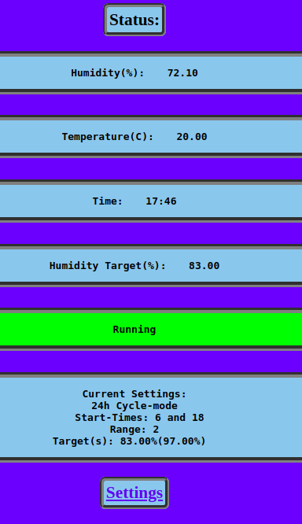
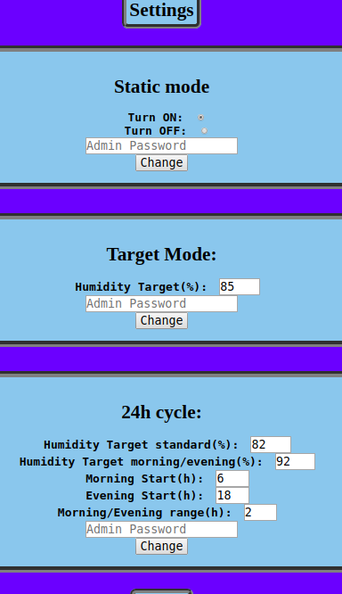

# Humidity Control for Terrarium

This is the codebase for a humidity monitor and controller designed for smaller spaces such as terrariums, this is particularly useful if you keep species of animals that require a certain amount of humidity to survive or prosper, in my case it is used to make sure my dart frogs always have a humidity thats 80%+ (This can be changed with a web interface through your phone).

[Here is a video showing of the project](https://www.youtube.com/watch?v=Oq-Q8FDIVVs)

------

## Electronics

If anyone is interested I can can provide more detailed instructions on how I made my fogger, for now here is a list of the basic components used.

- NODEMCU v3 ([More info](https://www.nodemcu.com/index_en.html))
- DHT21 AM2301 TEMPERATURE & HUMIDITY SENSOR ([More info](https://hobbycomponents.com/sensors/840-dht21-am2301-temperature-humidity-sensor))
- 5V relay (mine runs fine with just 3.3V)
- 12V fan
- UltraSonic Fogger (Theres plenty on ebay)

------

### User Interface

Since the NodeMCU has a built in WIFI chip you can easily track the status and change the settings of the device from your webbrowser simply by entering the local IP adress of the device. If you'd like to access it on another network you can portforward your router to get the status of your terrarium when out and about. Here is what the interface looks like, it works fine on both mobile and desktop:

| Index page                             | Settings Page                                |
| -------------------------------------- | -------------------------------------------- |
|  |  |

------

#### Modes:

**The device has several modes**

- <u>**Static mode**</u> that is either set to ON/OFF to manually control the fog in the terrarium
- **<u>Target mode</u>**, when enabled the device will try to make it so the terrarium always is around a certain humidity target
- **<u>24h Cycle</u>**, Similar to Target but allows you to have different targets for for evening and morning then the rest of the day to allow for a more natural simulation of how humidity is in nature. By default the standard target is 82% while being 92% from 6-8 and 18-20.

To change mode and settings you need Admin password which is standard as just "x" and can be changed in the main.ino file

------

#### TODO:

Email warning system once humidity falls below a certain level. Since the device is mostly used as a monitor system when I am home I usually manually add humidity, only turning the auto-fogger on when not home for an extended period of time. When I am home it would be nice if it would email me reminders when my frogs needed new water. This could also be used to notify me if the fogger ran out of water